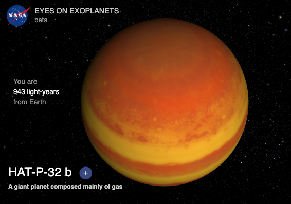

### NASA citizen science Project: [Discover Exoplanets and Measure their Light Curves!](https://exoplanets.nasa.gov/exoplanet-watch/about-exoplanet-watch/overview/)

When you look up into the night sky, do you wonder what's out there beyond our solar system? So do we! Come join us in learning more about exoplanets, the worlds that orbit distant stars.

You don't have to be a rocket scientist or an astrophysist to actively participate in studying distant worlds. We’ll teach you what you need to know to become a citizen scientist collecting important data on exoplanets, and you don’t even need to have your own telescope. 

We do! However, due to weather limited observing time via our own Bush Telescope, we are using data gathered via the Pat Boyce Foundation robotic telescope - a grant to Bush School!   

NASA’s citizen science projects welcome members of the public to work with NASA data, your own obervations of the night sky, or both. Through collaborations with NASA scientists, volunteers (known as citizen scientists) have helped make thousands of important scientific discoveries. By participating in Exoplanet Watch, you can work with NASA on exoplanet science and learn more about the process of doing science. You don't have to be a professional scientist to participate. 

#### What is an Exoplanet?

)

#### 1. Locate and learn about your assigned Exoplanet

Team | Locate Your assigned Exoplanet | Links for data
--- | --- | --- |
Team Lane | [Qatar-4b](https://exoplanets.nasa.gov/eyes-on-exoplanets/?destinations=%2Falien-worlds%2Fexoplanet-travel-bureau%3Fcid%3D1%2Ctravel_bureau_missions#/) | <a href="https://chandrunarayan.github.io/astronomy/projects/intro_to_jupyter" target="_blank">Introduction to Jupyter Notebooks Markdown and Python</a>
Team William | [WASP-80b](https://exoplanets.nasa.gov/eyes-on-exoplanets/?destinations=%2Falien-worlds%2Fexoplanet-travel-bureau%3Fcid%3D1%2Ctravel_bureau_missions#/)  | <a href="https://chandrunarayan.github.io/astronomy/projects/intro_to_jupyter" target="_blank">Introduction to Jupyter Notebooks Markdown and Python</a>
Team Best | [HAT P-53 b](https://exoplanets.nasa.gov/eyes-on-exoplanets/?destinations=%2Falien-worlds%2Fexoplanet-travel-bureau%3Fcid%3D1%2Ctravel_bureau_missions#/)  | <a href="https://chandrunarayan.github.io/astronomy/projects/intro_to_jupyter" target="_blank">Introduction to Jupyter Notebooks Markdown and Python</a>
Team Callie | [WASP-135 b](https://exoplanets.nasa.gov/eyes-on-exoplanets/?destinations=%2Falien-worlds%2Fexoplanet-travel-bureau%3Fcid%3D1%2Ctravel_bureau_missions#/)  |  <a href="https://chandrunarayan.github.io/astronomy/projects/intro_to_jupyter" target="_blank">Introduction to Jupyter Notebooks Markdown and Python</a>

#### 2. Click here to get the EXOTIC Jupyter Notebook to plot the Light Curve for your planet and do your analysis!

#### 3. OPTIONAL: Submit the light curve for publication to the American Association of Variable Star Observers (AAVSO)  

